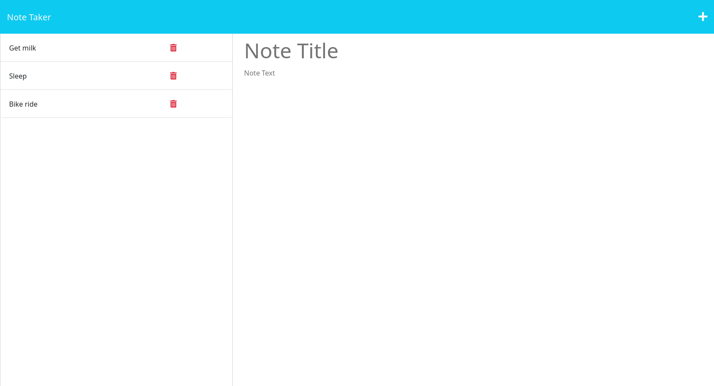

# Notes

Note taking web app.

## Usage

    The very first screen presents the splash screen containing a button to
    advance to the next screen:

    Clicking the `Get Started` button presents the user with the notes screen
    where new notes can be created and saved and pre-existing notes can be viewed
    and deleted:

    Once there's text in the note title and text input fields, the user is given
    the option to save the new note via the save icon in the upper right:

    Upon hitting the save button in the upper right corner, the new note will
    appear in the list of saved notes to the left and the input fields will be
    cleared:

    Clicking a note on the list to the left without clicking the delete icon
    will display the selected note to the right of the list:

---

Clicking the add icon (the `'+'`) in the upper right hand corner will deselect
the note and a new note title and text to be inputted.

Clicking the delete icon on one of the listed notes to the left will delete it.
